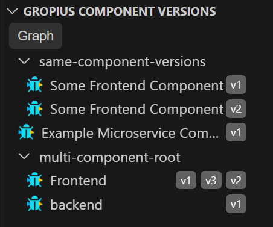
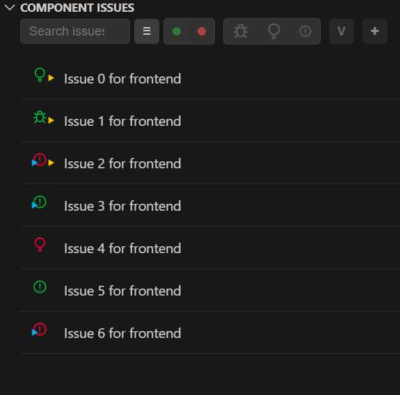
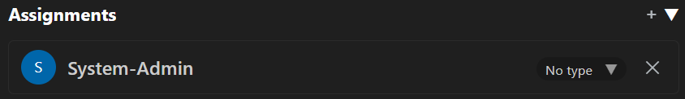
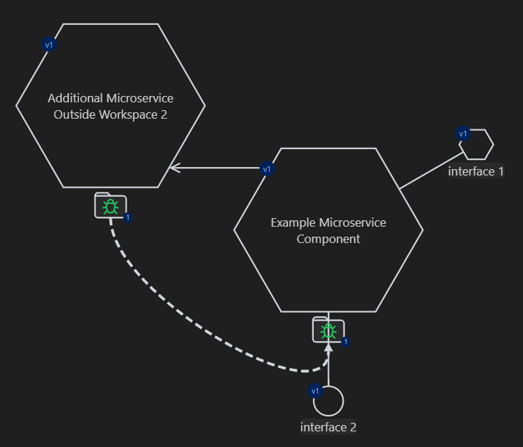

# Gropius Visual Studio Code Extension
The extension essentially consists of five different views:
* Workspace View
	* Shows all parts of the given workspace
* Component Versions View
	* Overview over all componentversions
* Component Issues View
	* All issues of the selected component version
* Issue Details View
	* Shows all details of the selected issue
* Project Graph View.
	* List of all projects of the workspace
	* Visualization of the selected project

## Workspace View

* This example shows the given "TEST-WORKSPACE"
* This includes the components
	* same-component-versions
	* direct-version-mapping
	* multi-component-root
	* unmapped-root
* And given component versions, e.g. "same-component-versions v1"

## Component Versions View
In this view you can see an overview of all components and the corresponding component versions.
Features:
* Workspace-Graph
* Components and component versions

### Workspace Graph
All component versions of the workspace are displayed. It contains the relations between the component versions, the issues, the issue relations and the interfaces. Open the graph with the “Graph” button. This opens a window that displays the graph.
#### Example graph

* This shows the graph of the example workspace
* Different componentversions like Frontend v1, backend v1, ...
* If there are relations, it is shown. E.g., between Frontend v1 and backend v1
* All issues of the corresponding component version is shown
	* Groups them by type and by state
	* Shows issue relation if there are any
* Shows the corresponding interfaces

## Component Issues View
This view is made up of the issues of the selected component.
* List all issues
	* IssueIcon with relation arrows
	* Issue name
* Options
	* Search issue
	* Sort
		* Desc 
		* Asc
	* Filter
		* By state
		* By type
		* Issues for selected component version
	* Add new issue

## Issue Details View
This overview shows all the details for a selected issue. The individual properties can also be changed.
Features:

* Edit title
* Open in Browser
* Change properties
	* Type
	* State
	* Labels
	* Description
	* Related Issues
	* Assignments
	* Artifacts
	* Estimated effort
* Issue graph

* Shows the graph for the selected issue "Build more issues 0 for project with interfaces"
* Includes
	* The important component versions
	* Related issue and the corresponding important component version
* Shows relations between the given component version if there are any
* Interfaces are shown too

### Edit title

* Change the title of the selected issue
* Updates the backend

### Open in Browser

* Button to open the issue view in the browser frontend
* Need to login into the gropius frontend

#### Example

### Properties
There are several properties of the given issue. All of them can be changed. If it is changed it would be updated in the backend.
#### Type

* Bug
* Feature
* MISC
* Task

#### State

* Change the state
* Open or close

#### Labels

* Shows all given labels of the issue
* Add or change labels

#### Description

* Shows the description
* Changeable

#### Related Issues

* Shows the related issues
* Icon shows the type

#### Assignements

* Shows all assignees of the issue
* Changeable

#### Artifacts

#### Estimated effort

* Estimated effort of the issue
* low, medium, hart

### Issue graph
This graph is created based on the selected issue. The component version that is most relevant is displayed. A component version is relevant if it is primarily part of the workspace and secondarily if it has many relations.
In addition, all relevant component versions of other issues that are related to the primary issue are displayed. If there are relations among the given component versions, these are also displayed. Finally, the interfaces of the component versions are displayed.
Open the graph with the “Graph” button. This opens a window that displays the graph.
#### Example graph

## Project Graph View
This is an overview of all existing projects. If you select a project, you can display the project graph.

#### Example project graph

* Shows the project graph for the project "Interface project"
* There are all included component versions of the project
* Includes
	* Issues
	* Component relations
	* Interfaces